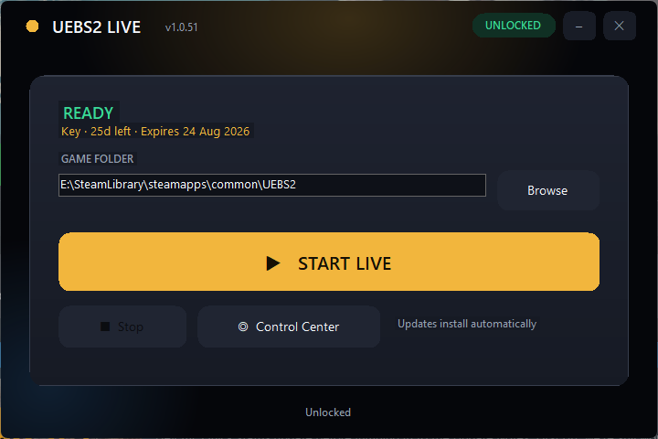
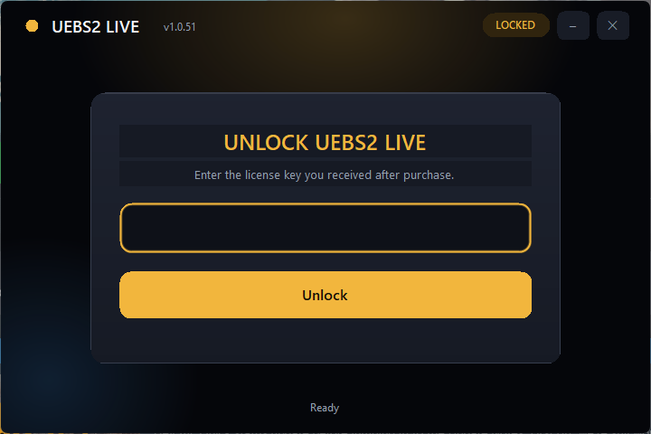

# UEBS2 LIVE

**TikTok LIVE + overlay in-game** — connect your stream, track gifts, and run LIVE battles from one launcher.

*English: TikTok LIVE integration with in-game overlay, gifts stats, and OBS ads.*

---

## Features

- **TikTok LIVE** — connection with username, room, and viewers
- **Live stats** — gifts, diamonds, likes, and engagement in real time
- **In-game overlay** — LIVE battle / plugin experience inside the game
- **OBS ads** — push text, image, or GIF ads from the admin panel
- **License key** — activate with your key
- **Launcher** — simple Start LIVE flow, ready in a few clicks

---

## Screenshots

### Launcher — READY / Start LIVE

### Unlock — enter license key

---

## Buy a key / Chri key

Contact on WhatsApp to purchase a license key:

**WhatsApp:** [+212 654 940 735](https://wa.me/212654940735)  
Direct link: https://wa.me/212654940735

---

## Releases

Public release assets (payload + update manifest) for UEBS2 LIVE.  
The application source code lives in a separate private repository.  
Clients auto-update from the latest release’s `manifest.json`.

*Do not put admin passwords, API secrets, or management tokens in this file.*
